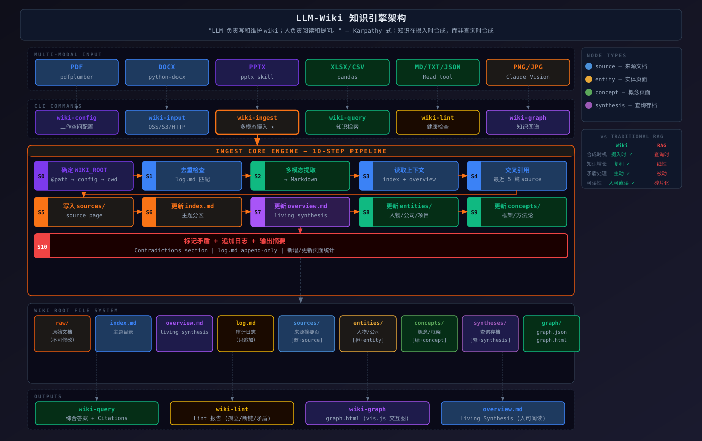

# LLM Wiki Skill — 多模态知识图谱 Skill

> *"LLM 写入并维护 Wiki；人类阅读和提问。"*



**多语言版本:** [简体中文](lang/README.zh-CN.md) | [繁體中文](lang/README.zh-TW.md) | [日本語](lang/README.ja.md) | [한국어](lang/README.ko.md) | [Français](lang/README.fr.md) | [Русский](lang/README.ru.md) | [Español](lang/README.es.md)


---

## 这是什么？

`llm-wiki-skill` 是一个运行在 Claude Code 中的 Skill，可将任意格式的原始文档（PDF、DOCX、PPTX、XLSX、Markdown、图片）摄入为结构化 Wiki，并自动构建交互式知识图谱（`graph.html`）。

它实现了 Karpathy 提出的知识管理理念：**知识在摄入时合成，而非查询时组装**。每次添加新文档时，LLM 自动提取要点、建立交叉引用、标记矛盾并更新合成摘要——使知识库随每次摄入产生复利增长。

与 RAG 的核心区别：RAG 将原始文档倒入向量存储并在查询时临时组装答案；`llm-wiki-skill` 在摄入时将知识编译为持久的 Wiki 页面，查询时直接读取已合成的结论。

### 三层架构

```
Layer 3 — SCHEMA.md     定义领域、约定、标签分类法（约束层）
    ↓
Layer 2 — Wiki 页面      entity/concept/comparison/query 页面（知识层）
    ↓
Layer 1 — raw/ 来源     不可变的原始文档（数据层）
```

---

## 目录结构

```
<wiki-root>/
├── SCHEMA.md                    # 领域定义 + 标签分类法 + 约定
├── index.md                     # 分区内容目录，每页一行摘要
├── overview.md                  # 跨来源动态合成摘要
├── log.md                       # 按时间追加型操作日志（超 500 条自动轮转）
│
├── raw/                         # 不可变原始来源
│   ├── articles/                # 网页文章、剪报
│   ├── papers/                  # PDF、arxiv 论文
│   ├── transcripts/             # 会议笔记、访谈
│   ├── assets/                  # 图片、图表
│   └── <custom-topic>/          # 自定义主题目录
│
├── entities/                    # 实体页（人物/公司/项目/产品）
├── concepts/                    # 概念页（概念/框架/方法论）
├── comparisons/                 # 对比分析页
├── queries/                     # 有价值的查询结果归档
│
├── wiki/                        # 兼容层
│   ├── sources/                 # 每个原始文档的摘要页
│   ├── syntheses/               # 查询答案归档（queries/ 的别名）
│   └── archive/                 # 归档的过期页面
│
└── graph/
    ├── graph.json               # 节点 + 边数据
    └── graph.html               # 基于 vis.js 的独立可视化
```

---

## 命令参考

| 命令 | 功能 |
|---|---|
| `wiki-config workspace <path>` | 设置 wiki 工作区路径 |
| `wiki-config show` | 查看当前配置和目录状态 |
| `wiki-input <path> [--topic <slug>]` | 摄入任意文件路径（自动归档到 `raw/<topic>/`） |
| `wiki-ingest <file>` | 摄入已在 `raw/` 中的文件 |
| `wiki-query: <问题>` | 查询知识库，综合答案 |
| `wiki-lint` | 检查孤立页、坏链、矛盾、来源漂移等 |
| `wiki-graph` | 构建交互式知识图谱（`graph.html`） |

**日常使用推荐：`wiki-input`** — 接受本地或远程路径，摄入前自动复制到 `raw/<topic>/` 归档。无需手动管理 `raw/` 目录。

---

## 工作流

### 摄入

摄入文档时，LLM 按顺序执行：

1. 读取 `SCHEMA.md` 理解领域约定和标签分类法
2. 多模态内容提取（PDF/DOCX/PPTX/XLSX/图片 → Markdown）
3. 写入 `wiki/sources/<slug>.md`（摘要、要点、关键引用）
4. 更新 `index.md` 和 `overview.md`
5. 创建或更新 `entities/`、`concepts/` 页面
6. 如来源包含对比信息，创建或更新 `comparisons/` 页面
7. 标记与现有内容的矛盾
8. 追加操作日志到 `log.md`

### 查询

读取 `index.md` 识别相关页面，综合答案并使用 `[[页面名]]` 行内引用。实质性答案可归档到 `queries/<slug>.md`。

### 知识图谱

提取页面间的显式 wikilinks（`EXTRACTED`）和 AI 推断的语义关联（`INFERRED`，置信度 ≥ 0.5），生成零依赖的独立 `graph.html`，带节点类型着色和社区分组。

---

## 支持的格式

| 格式 | 提取方法 |
|---|---|
| `.md` `.txt` | 直接读取 |
| `.pdf` | pdfplumber（文本 + 表格） |
| `.docx` | python-docx（正文 + 标题 + 表格） |
| `.pptx` | python-pptx（标题 + 正文 + 备注） |
| `.xlsx` `.csv` | pandas（转为 Markdown 表格） |
| `.png` `.jpg` `.jpeg` `.webp` `.gif` `.bmp` | Claude 视觉（多模态） |

---

## 快速开始

```bash
# 1. 设置 wiki 工作区
wiki-config workspace ~/my-wiki

# 2. 摄入第一篇文档
wiki-input ~/Downloads/paper.pdf --topic papers

# 3. 查询
wiki-query: 这篇论文的核心贡献是什么？

# 4. 构建知识图谱
wiki-graph
```

> **首次初始化后**：编辑 `SCHEMA.md`，填写你的 Wiki 覆盖的领域和标签分类法。

---

## 新增功能（融合版）

| 功能 | 说明 |
|------|------|
| **SCHEMA.md 约束** | 定义领域、标签分类法、页面约定，确保一致性 |
| **三层架构** | Raw → Wiki → Schema 分层，知识管理更清晰 |
| **comparisons/** | 专门的对比分析页目录，支持多维度表格对比 |
| **queries/** | 查询结果归档，替代 syntheses/（兼容旧版） |
| **质量信号** | `confidence`、`contested`、`contradictions` frontmatter 字段 |
| **来源漂移检测** | SHA256 检测，重新摄入同一 URL 时自动发现内容变化 |
| **标签审计** | 标签必须在 SCHEMA.md 分类法中预定义，防止标签泛滥 |
| **日志轮转** | log.md 超 500 条自动轮转为 log-YYYY.md |
| **页面拆分** | 页面超 200 行自动提示拆分为子主题 |
| **会话定向** | 每次会话开始必须先读 SCHEMA + index + 最近 log，防止重复和矛盾 |

---

## 多模态支持

`llm-wiki-skill` 使用 Claude 的原生多模态能力理解图像内容——不仅是 OCR，而是全面语义理解图表、图表和截图。

### 独立图片摄入

直接将图片文件传给 `wiki-input` 或 `wiki-ingest`。Claude 读取图片并将其内容转为结构化 Markdown，然后进入标准摄入流程：

```bash
wiki-input ~/screenshots/architecture-diagram.png --topic system-design
wiki-input ~/photos/whiteboard-session.jpg --topic meetings
```

**Claude 从图片中提取的内容：**
- **图表和数据图** — 数据系列、轴标签、趋势和数值
- **Diagram 和流程图** — 节点、边、关系和流向
- **截图** — UI 结构、可见文本和布局上下文
- **手写笔记 / 白板** — 转录的文本和绘制的结构
- **图片中的表格** — 重建为 Markdown 表格
- **混合内容** — 同时包含文本和图的拍照/扫描文档

---

---

## 安装与初始化

### 安装

将 `skills/llm-wiki/` 目录复制到 Claude Code 的 `.claude/skills/` 下：

```bash
# 克隆仓库（Hermes 分支）
git clone -b Hermes https://github.com/vincentyzhj/llm-wiki-skill.git

# 复制 Skill 到 Claude Code 项目
cp -r llm-wiki-skill/skills/llm-wiki /你的项目/.claude/skills/llm-wiki
```

对于 Hermes Agent，Skills 目录为：

```bash
# 复制到 Hermes Agent 的 Skills 目录
cp -r llm-wiki-skill/skills/llm-wiki ~/.hermes/skills/llm-wiki
```

### 初始化

```bash
# 1. 设置 Wiki 工作区路径
wiki-config workspace ~/my-wiki

# 2. 初始化会自动创建完整目录结构（包括 SCHEMA.md、comparisons/、queries/ 等）

# 3. ⚠️ 重要：编辑 SCHEMA.md，填写你的 Wiki 领域和标签分类法
#    这一步决定了后续所有摄入的质量约束
#    打开 ~/my-wiki/SCHEMA.md 填写：
#    - Domain: 你的 Wiki 覆盖的领域
#    - 标签分类法: 定义 10-20 个顶级标签
#    - 页面阈值: 创建/拆分/归档页面的规则

# 4. 摄入第一篇文档
wiki-input ~/Downloads/paper.pdf --topic papers

# 5. 查询
wiki-query: 这篇论文的核心贡献是什么？

# 6. 构建知识图谱
wiki-graph

# 7. 健康检查
wiki-lint
```

> **不编辑 SCHEMA.md 也能用**，但 Agent 在摄入时不会遵循标签约束和质量信号，等于丢掉了融合版的核心价值。

### 目录结构（初始化后）

```
~/my-wiki/
├── SCHEMA.md       ← 领域定义 + 标签分类法（需要手动编辑）
├── index.md        ← 自动生成
├── overview.md      ← 自动生成
├── log.md          ← 自动生成
├── raw/
│   ├── articles/
│   ├── papers/
│   ├── transcripts/
│   ├── assets/
│   └── inbox/
├── entities/
├── concepts/
├── comparisons/
├── queries/
├── wiki/
│   ├── sources/
│   ├── syntheses/
│   └── archive/
└── graph/
```

### 图谱构建依赖

如需使用 `wiki-graph` 命令构建交互式知识图谱：

```bash
pip install networkx python-louvain anthropic
```

不安装也能用 Wiki 的摄入、查询、Lint 功能，只是无法自动生成 `graph.html`。

---

## 参考

- [Anthropic Skills — 官方 Skills 仓库](https://github.com/anthropics/skills)
- [Andrej Karpathy — LLM Wiki 概念](https://gist.github.com/karpathy/442a6bf555914893e9891c11519de94f)
- [Hermes Agent — llm-wiki v2.1.0 Skill](https://github.com/vincentyzhj/llm-wiki-skill)
- [SamurAIGPT — llm-wiki-agent](https://github.com/SamurAIGPT/llm-wiki-agent)
