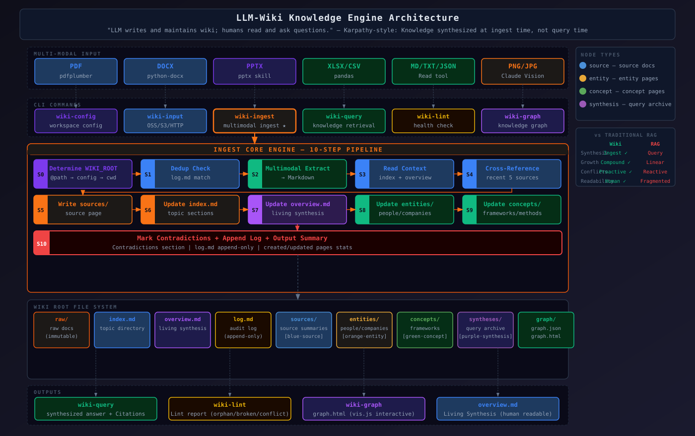

# LLM Wiki — 멀티모달 지식 그래프 스킬

> *"LLM이 wiki를 작성하고 유지한다. 사람은 읽고 질문한다."*



**다른 언어：** [English](../README.md) | [简体中文](README.zh-CN.md) | [繁體中文](README.zh-TW.md) | [日本語](README.ja.md) | [Français](README.fr.md) | [Русский](README.ru.md) | [Español](README.es.md)

---

## 이것은 무엇인가

`llm-wiki`는 Claude Code에서 실행되는 Skill로, 임의 형식의 원시 문서(PDF, DOCX, PPTX, XLSX, Markdown, 이미지)를 구조화된 Wiki에 수집하고 인터랙티브한 지식 그래프(`graph.html`)를 자동으로 구축합니다.

Karpathy가 제안한 지식 관리 철학을 구현합니다: **지식은 수집 시점에 합성되며, 쿼리 시점이 아닙니다**. 새로운 문서가 추가될 때마다 LLM이 자동으로 핵심 사항을 추출하고, 상호 참조를 구축하고, 모순을 표시하고, 종합 요약을 업데이트하여 지식 베이스가 수집할 때마다 복리로 성장합니다.

RAG와의 핵심 차이점: RAG는 원시 문서를 벡터 저장소에 넣고 쿼리 시점에 임시로 답변을 조합하지만, llm-wiki는 수집 시점에 지식을 내구성 있는 wiki 페이지로 컴파일하여 쿼리 시점에 이미 합성된 결론을 읽습니다.

---

## 디렉토리 구조

```
<wiki-root>/
├── SCHEMA.md                    # 도메인 정의 + 태그 분류법 + 규칙
├── index.md                     # 파티션별 콘텐츠 목차, 페이지당 한 줄 요약
├── overview.md                  # 모든 소스를 아우르는 living synthesis
├── log.md                       # 추가 전용 작업 로그 (500개 초과 시 자동 순환)
│
├── raw/                         # 불변 원시 소스
│   ├── articles/                # 웹 기사, 클리핑
│   ├── papers/                  # PDF, arxiv 논문
│   ├── transcripts/             # 회의 노트, 인터뷰
│   ├── assets/                  # 이미지, 다이어그램
│   └── <custom-topic>/          # 사용자 정의 주제 디렉토리
│
├── sources/                     # 각 원시 문서의 요약 페이지
├── entities/                    # 엔티티 페이지 (인물/회사/프로젝트/제품)
├── concepts/                    # 개념 페이지 (개념/프레임워크/방법론)
├── comparisons/                 # 비교 분석 페이지
├── queries/                     # 가치 있는 쿼리 결과 아카이브
├── archive/                     # 아카이브된 오래된 페이지
│
└── graph/
    ├── graph.json               # 노드 + 엣지 데이터
    └── graph.html               # vis.js 기반 자체 포함 시각화
```

---

## 명령어 참조

| 명령어 | 용도 |
|---|---|
| `wiki-config workspace <path>` | wiki 워크스페이스 경로 설정 |
| `wiki-config show` | 현재 설정 및 디렉토리 상태 보기 |
| `wiki-input <path> [--topic <slug>]` | 임의 경로 파일 수집 (`raw/<topic>/`에 자동 아카이브) |
| `wiki-ingest <file>` | `raw/`에 이미 있는 파일 수집 |
| `wiki-query: <질문>` | 지식 베이스 조회, 답변 합성 |
| `wiki-lint` | 고립 페이지, 깨진 링크, 모순 등 품질 문제 확인 |
| `wiki-graph` | 인터랙티브 지식 그래프 구축 (`graph.html`) |

**일상적 사용에는 `wiki-input` 권장**: 로컬 또는 원격 경로를 받아 수집 전에 자동으로 `raw/<topic>/`에 복사합니다. `raw/` 디렉토리 수동 관리 불필요.

---

## 워크플로우

### 수집 (Ingest)

문서를 수집할 때 LLM은 순서대로 실행합니다:

1. `SCHEMA.md` 읽기 — 도메인 규칙과 태그 분류법 이해
2. 멀티모달 콘텐츠 추출 (PDF/DOCX/PPTX/XLSX/이미지 → Markdown)
3. `sources/<slug>.md` 작성 (요약, 핵심 사항, 주요 인용)
4. `index.md` 및 `overview.md` 업데이트
5. `entities/` 및 `concepts/` 페이지 생성 또는 업데이트
6. 소스에 비교 정보가 포함된 경우 `comparisons/` 페이지 생성 또는 업데이트
7. 기존 콘텐츠와의 모순 표시
8. `log.md`에 작업 로그 추가

### 쿼리 (Query)

`index.md`를 읽어 관련 페이지를 식별하고, `[[PageName]]` 형식의 인라인 참조로 답변을 합성합니다. 실질적인 답변은 `queries/<slug>.md`로 아카이브할 수 있습니다.

### 지식 그래프 (Graph)

페이지 간 명시적 wikilink(`EXTRACTED`)와 AI 추론 의미 연관(`INFERRED`, 신뢰도 ≥ 0.5)을 추출하여 노드 타입 색상 구분과 커뮤니티 그룹화를 지원하는 제로 의존성 자체 포함 `graph.html`을 생성합니다.

---

## 지원 형식

| 형식 | 추출 방법 |
|---|---|
| `.md` `.txt` | 직접 읽기 |
| `.pdf` | pdfplumber (텍스트 + 테이블) |
| `.docx` | python-docx (본문 + 제목 + 테이블) |
| `.pptx` | python-pptx (제목 + 본문 + 노트) |
| `.xlsx` `.csv` | pandas (Markdown 테이블로 변환) |
| `.png` `.jpg` `.jpeg` `.webp` `.gif` `.bmp` | Claude vision (멀티모달) |

---

## 멀티모달 지원 상세

`llm-wiki`는 Claude의 네이티브 멀티모달 기능을 사용하여 이미지 콘텐츠를 이해합니다 — 단순한 OCR 텍스트 인식이 아니라 다이어그램, 차트, 스크린샷의 완전한 의미론적 이해를 제공합니다.

### 이미지 파일 직접 수집

이미지 파일을 `wiki-input` 또는 `wiki-ingest`에 직접 전달하세요. Claude가 이미지를 읽고 구조화된 Markdown으로 변환한 후 표준 Ingest 워크플로우를 실행합니다:

```bash
wiki-input ~/스크린샷/아키텍처-다이어그램.png --topic system-design
wiki-input ~/사진/화이트보드-세션.jpg --topic meetings
```

**Claude가 이미지에서 추출하는 콘텐츠:**
- **차트 & 그래프** — 데이터 시리즈, 축 레이블, 트렌드, 수치 값
- **다이어그램 & 플로우차트** — 노드, 엣지, 관계, 흐름 방향
- **스크린샷** — UI 구조, 표시 텍스트, 레이아웃 컨텍스트
- **손으로 쓴 메모 / 화이트보드** — 전사된 텍스트와 그려진 구조
- **이미지 내 테이블** — Markdown 테이블로 재구성
- **혼합 콘텐츠** — 텍스트와 그림이 포함된 촬영 또는 스캔된 문서

### 문서에 내장된 이미지

내장 이미지가 포함된 PDF, DOCX 또는 PPTX를 수집할 때 각 추출 도구는 모든 텍스트 콘텐츠를 캡처합니다. 이해에 중요한 그림이나 다이어그램이 텍스트 추출만으로는 충분하지 않은 경우, 해당 그림을 이미지 파일로 별도로 수집하세요.

### 지원되는 이미지 형식

| 형식 | 설명 |
|---|---|
| `.png` | 무손실; 스크린샷, 다이어그램에 적합 |
| `.jpg` / `.jpeg` | 사진, 스캔된 문서 |
| `.webp` | 웹 최적화 이미지 |
| `.gif` | 첫 번째 프레임 분석 (정적 콘텐츠) |
| `.bmp` | 비압축 비트맵 |

### 멀티모달 추출 파이프라인

모든 이미지 콘텐츠는 텍스트 문서와 동일한 Ingest 파이프라인을 따릅니다 — 이미지는 파이프라인에 들어가기 전에 Markdown으로 변환될 뿐입니다:

```
이미지 파일
    │
    ▼
Claude Vision (Read 도구)
    │  추출: 텍스트, 구조, 데이터, 관계
    ▼
Markdown 설명
    │
    ▼
표준 Ingest 워크플로우 (단계 2–10)
    │  sources/ entities/ concepts/ index/ overview/ log/
    ▼
Wiki 페이지 + 지식 그래프
```

---

## 빠른 시작

```bash
# 1. wiki 워크스페이스 설정
wiki-config workspace ~/my-wiki

# 2. 첫 번째 문서 수집
wiki-input ~/Downloads/paper.pdf --topic papers

# 3. 쿼리
wiki-query: 이 논문의 핵심 기여는 무엇인가요?

# 4. 지식 그래프 구축
wiki-graph
```

---

## 참조

- [Anthropic Skills — 공식 스킬 저장소](https://github.com/anthropics/skills)
- [Andrej Karpathy — LLM Wiki concept](https://gist.github.com/karpathy/442a6bf555914893e9891c11519de94f)
- [SamurAIGPT — llm-wiki-agent](https://github.com/SamurAIGPT/llm-wiki-agent)
